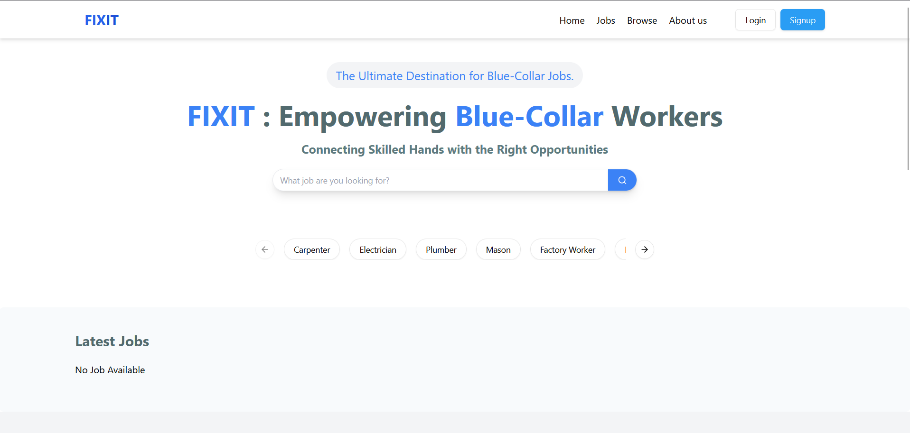

# 🔧 FIXIT Frontend



FIXIT is a dedicated platform designed to connect blue-collar workers with job opportunities tailored to their skills and expertise.

Whether you're a skilled worker looking for your next opportunity or a business seeking reliable talent, FIXIT is here to make the process effortless and rewarding.

**Live Website**: [Visit FIXIT]([https://your-deployed-site-link.com](https://rozgarhubbluecollarjob.netlify.app/))
---

## Overview

Whether you're a skilled worker looking for your next opportunity or a business seeking reliable talent, FIXIT is here to make the process effortless and rewarding.

---

##  Features

- User and Employer UI
- Job listing and filtering by skill/location
- Login & Signup interfaces
- Mobile responsive design
- Interactive dashboard

---

##  Tech Stack

- **Framework**: React (with Vite/CRA)
- **Styling**: Tailwind CSS / CSS Modules / SCSS
- **Routing**: React Router DOM
- **State Management**: Context API / Redux (if used)

---

##  Getting Started

### Prerequisites

- Node.js (v16+)
- npm or yarn


### Installation

```bash
git clone https://github.com/parthiv817/frontend.git
cd frontend
npm install


